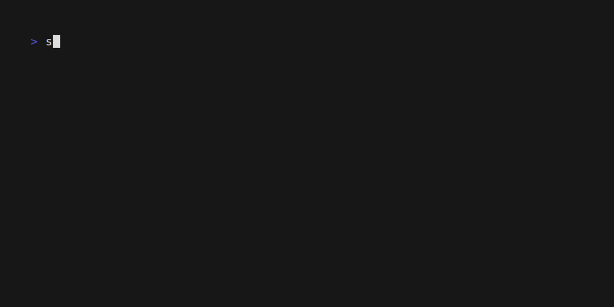

# Scopious

Manage scope with ease

## Install

Scopious can be installed a couple different ways.

### Download from prebuilt binaries from Github releases.

Current build can be found at https://github.com/analog-substance/scopious/releases

### Golang Install

```bash
go install github.com/analog-substance/scopious@latest
```

## Usage

Scopius has a few ways to manage scope. It stores scoping information in text files within the `scope/` folder. Scopius accepts scope as arguments and as data streams.

### Add


You can add IP addresses and domains. Scopius will figure out where to put them.

```bash
scopius add test.dev
scopius add 127.0.0.1/24
```

### Exclude



### Expand

Sometimes you dont want to add CIDRs to scope, but you need to expand them.


## About

Scope is stored in text files withing the `scope/` dir by default. However, this behavior can be changed with the `--scope-dir` option or within the config file.

```txt
scope/
    internal/
        domains.txt
        ipv4.txt
        ipv6.txt
        
    external/
        domains.txt
        ipv4.txt
        ipv6.txt
                
    internal-aws/
        domains.txt
        ipv4.txt
        ipv6.txt
```